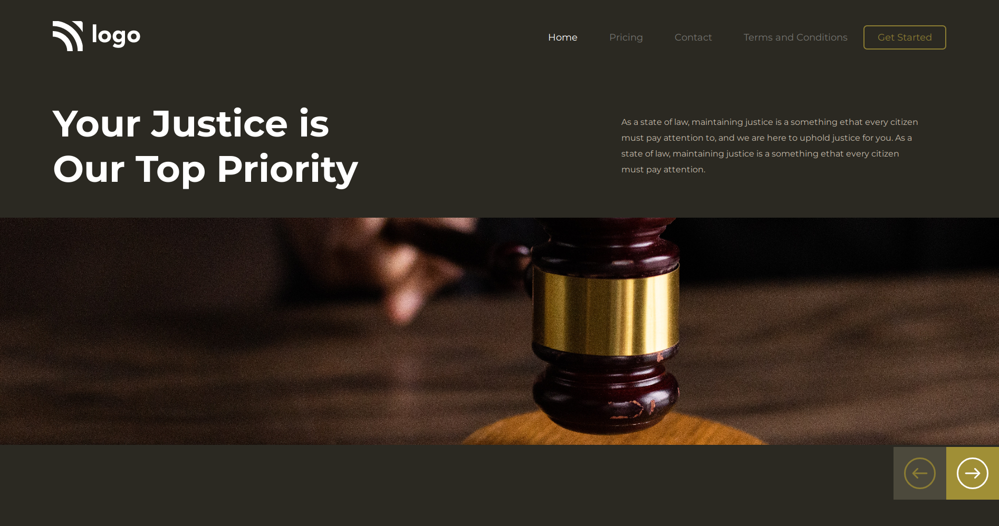

# Project 3

## `Nishok Maharaaj`

## Learnings    

This is the third project in the HTML and CSS class. I have learnt how to position images in a webpage and how to resize them accordingly.

## [Project Live Link](https://github.com/nishok19/html-css-proj-3)

## Efforts

This project took around 1 hour to build. Positioning the image took most of the time

### Screenshot

